# Ứng dụng Android quản lý cửa hàng bán thiết bị di động dành cho Admin
# Một số hình ảnh demo sản phẩm
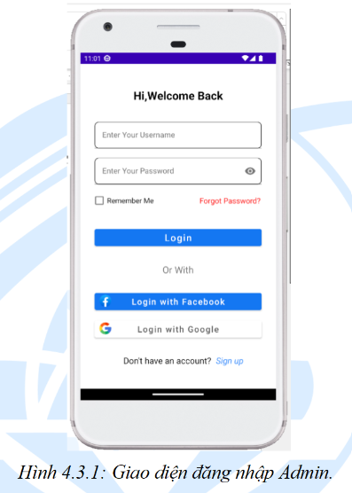
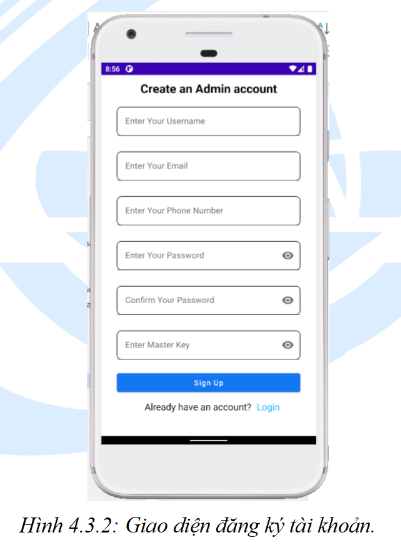
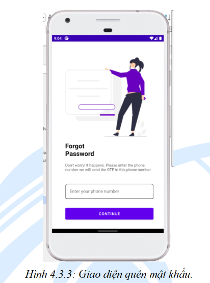

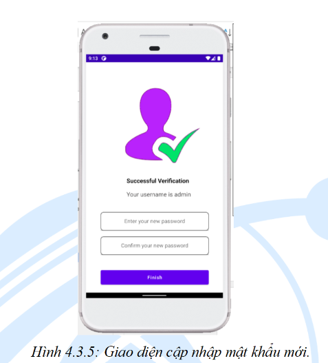
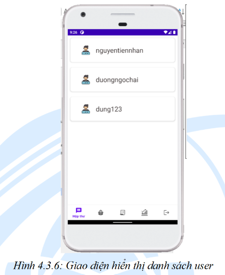
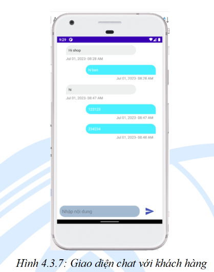
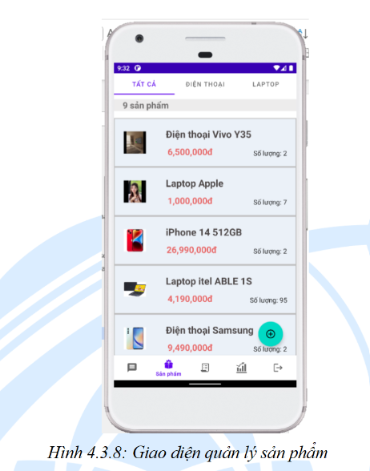
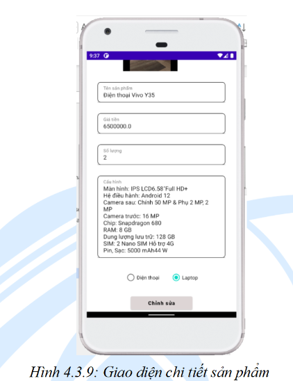
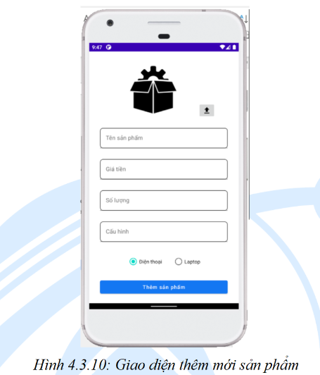
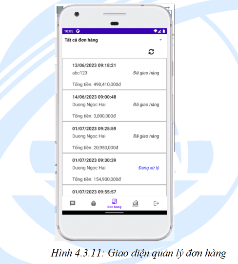
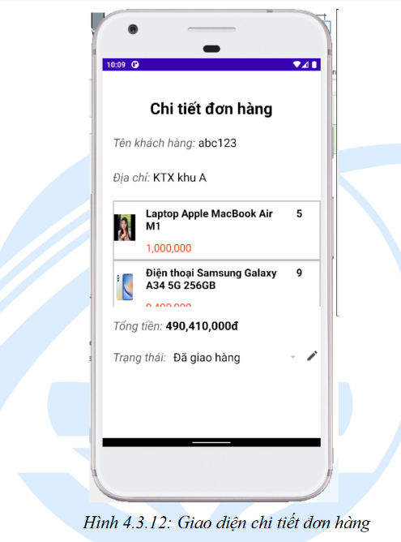
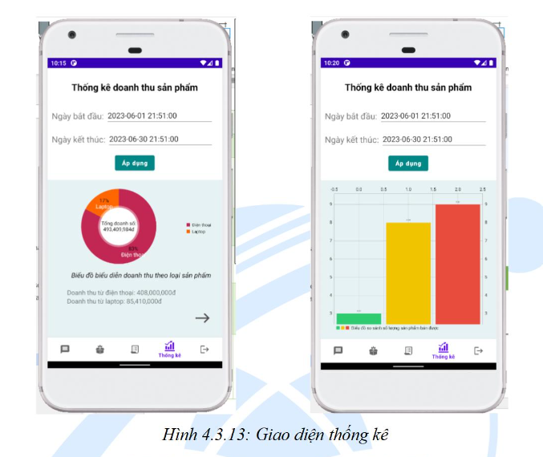
# Kết quả đạt được
Trong quá trình thực hiện đồ án ứng dụng, em đã tổng kết được một số điểm tích cực như sau:

- Hiểu và vận dụng được kiến thức đã học vào đề tài.
- Tìm kiếm thêm nhiều công cụ, kiến thức mới phục vụ cho đề tài.
- Ứng dụng có các chức năng cơ bản của một ứng dụng thương mại điện tử.
- Có kinh nghiệm cho các đề tài sau và các dự án với quy mô lớn hơn.

## Mục tiêu phát triển
Trong tương lai gần, chúng tôi đặt ra một số mục tiêu để phát triển đề tài được hoàn thiện và chỉnh chu hơn như sau:

- Hoàn thiện chức năng đã đề ra nhưng chưa hoàn thiện.
- Cải thiện giao diện người dùng sao cho tối ưu, đẹp, hiện đại.
- Tăng cường bảo mật cho hệ thống, bảo vệ người dùng.

